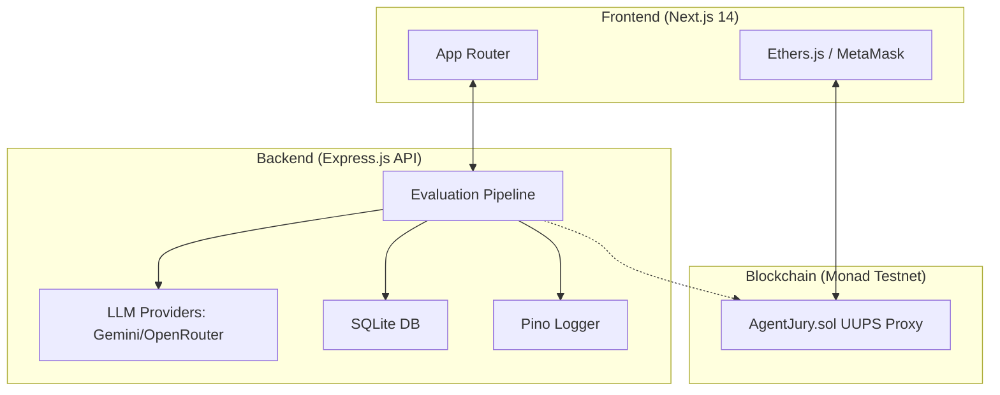

# Agent Jury

**Multi-agent AI evaluation system with on-chain verdict storage.**

Three specialized AI agents (Feasibility, Innovation, Risk & Ethics) independently evaluate a startup case, a weighted scoring algorithm produces a final decision, and the result is saved immutably on a smart contract via MetaMask.

**Stack:** Next.js 14 · Express.js · Ethers.js v6 · Solidity 0.8.24 · OpenZeppelin UUPS · Hardhat · Pino · SQLite · Docker · Nginx · GitHub Actions

## Architecture Overview



**Flow:** Connect wallet → Submit case text → 3 AI agents evaluate independently → Weighted scoring → Final verdict → User signs transaction via MetaMask → Verdict stored on-chain immutably.

---

## Project Structure

```text
agent_jury/
├── backend/                # Express API – multi-agent evaluation pipeline
├── contracts/              # Solidity smart contract + Hardhat
├── frontend/               # Next.js 14 (App Router) UI
├── infra/                  # Nginx configuration
└── .github/workflows/      # CI/CD pipelines
```

---

## Technical Details

### 1) Smart Contract
**Path:** `contracts/src/AgentJury.sol`
- **Solidity:** 0.8.24
- **Pattern:** UUPS Upgradeable Proxy (OpenZeppelin v5.x)
- **Features:** RBAC, custom errors, gas-optimized (uint40 timestamps, packed structs).

### 2) Backend
**Runtime:** Node.js 20 · **Framework:** Express.js
- **Multi-Agent Pipeline:** Feasibility, Innovation, Risk & Ethics scoring.
- **LLM Support:** Dual-provider (Gemini & OpenRouter) with automatic fallback.
- **Security:** Timing-safe API key auth, rate limiting, prompt injection defense.
- **Observability:** Prometheus metrics, structured Pino logging, X-Request-Id tracing.

### 3) Frontend
**Framework:** Next.js 14 (App Router) · **Blockchain:** Ethers.js v6
- **UX:** Staggered agent reveal, live transaction tracking, skeleton loaders.
- **A11y:** Screen reader support, keyboard navigation, reduced motion support.
- **Features:** Multi-criteria history filtering, automatic network switching.

---

## Quick Start

### 1. Prerequisites
- Node.js 20+
- MetaMask extension
- API Keys for Gemini or OpenRouter

### 2. Installation
```bash
# Install everything
cd backend && npm install
cd ../frontend && npm install
cd ../contracts && npm install
```

### 3. Environment Setup
Fill in the `.env` files in each directory based on the `.env.example` templates:
- `backend/.env`
- `contracts/.env`
- `frontend/.env.local`

### 4. Running the Project
```bash
# Backend (Local)
cd backend && npm run dev

# Frontend (Local)
cd frontend && npm run dev
```

---

## Deployment
The project includes **Docker** and **Nginx** configurations for production deployment:
```bash
docker compose --profile production up -d
```

## License
MIT
